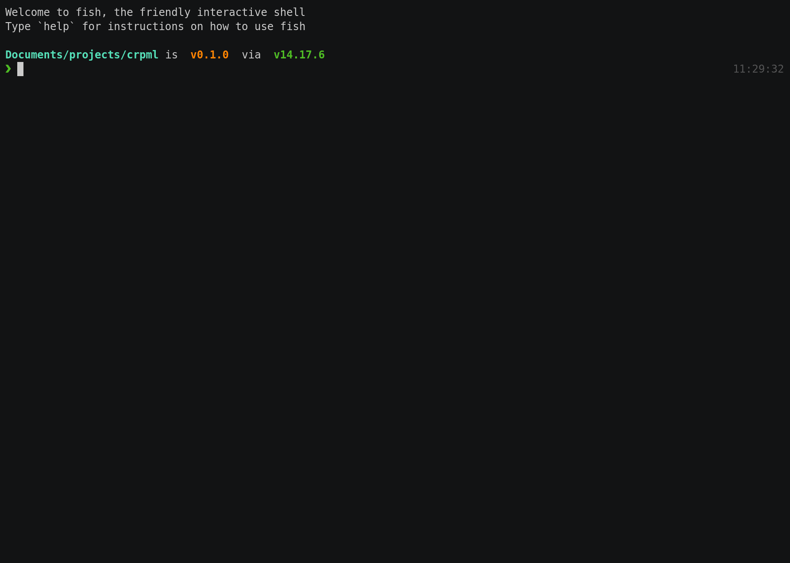

# CRPML

[](https://asciinema.org/a/ayZ8qhkd8qLcDLbAktl7uoEZG)

(Click for a slower verison)

---

CRPML (initially *Create RadiantPM Library*) is an extremely configurable project initialiser (think `create-react-app`
but you control all the templates).

Basically, you create a `.crpml` directory somewhere (maybe a monorepo’s root, or your home directory), then you create
some templates, and now you can call `crpml` in any child directory and it will copy that template (with variants
applied).

## Terms

Before we get started, here’s some terms that will be used:

- **output**: The output of CRPML. This will be a folder containing the chosen template.
- **project directory**: The directory that contains the `.crpml` directory.
- **config directory**: The `.crpml` directory, containing the `config.json` file and the `templates` directory.
- **templates directory**: The `templates` directory inside the config directory.
- **template directory**: A directory containing a template, which is inside the templates directory.
- **variant directory**: A directory containing one of the variants for a template.

## Setup

CRPML takes a bit of time to get started because you need to create the templates you want.

First, create a directory called `.crpml` somewhere. It doesn’t matter where this is, so long as it is in a directory
that is a parent of (or the) directory you want to run `crpml` in.

### Config file

This directory should contain a file, `config.json` (you can get a schema for this file
from <!--BEGIN SCHEMA_URL"config"-->https://rad.gd/dev/crpml@0.0.0/config.schema.json <!--END-->).

This file can have a key `outDir` which points to the directory that the output will be written to, relative to the
project directory, so that you don’t have to change into the root of your project each time you run CRPML. It defaults
to whatever the current working directory is (which is useful if you are putting the config directory inside your home
directory).

It can also have a key `scope`, which is a scope that CRPML will force any package name to use. For now this only works
for npm-like templates, but in the future it may be expanded to support more formats.

### Templates

The config directory should contain a subdirectory called `templates`. This is, surprisingly, where you put the actual
templates. In here, you can make as many directories as you want. Their names will be used as the ID of that template so
make it something reasonable.

Inside each template’s directory, create a file called `template.json` (the schema is available at
from <!--BEGIN SCHEMA_URL"template"-->https://rad.gd/dev/crpml@0.0.0/template.schema.json <!--END-->). For now, set
a `displayName` (the name shown to the user) and a `description` if you want to (some short text shown after the display
name). You will fill out the rest of the file as you go.

#### Variants

Every template has at least one variant. These are “sub-templates”, which can be merged together for more
configurability for the user, and so you don’t have to create a template for every combination. For example, you might
have a variant that enables typings for NodeJS, and maybe a variant that adds a logging library to the dependencies.

> To decide if something should be multiple templates or variants of one template, you can follow a quick rule of
> thumb - if one of the options blocks another option, they should be separate templates. Otherwise, use variants. Of course, you don’t have to follow this, and you may want to do it another way for some reason, it is up to you.

A template must have at least one variant. Generally it has a “base” variant, which includes all the common files, like
the project file and the dependencies file.

Variants are placed in subdirectories of a template’s directory. The name of the directory is used as the variant’s ID.
The files inside the directory are used as the template files.

To tell CRPML about a variant, add it (using its ID as the key) to an object under `variants`  in the `template.json`.
This object must have a `displayName` field, which is the name of the variant shown to the user, and a `files` field,
which is a list of the paths to each file that the variant contains, relative to the variant’s directory. You can also
include a `description` which is shown beside the display name.

You can force a variant to be used with the `required` field. You should set this value to `true` for your base variant,
but you can set it on other ones too if you want to. A variant defaults to not be required.

If a variant adds scripts to the `package.json` file, you should set these in the `scripts` field (which is an array).

##### Overriding a file

If one file is set by multiple variants, you should add a `mergeMethod` for the file to tell CRPML how to merge them. To
do this, create an object at `files.[file name]` (where the file name is the same as in the `variants.*.files`) and set
the `mergeMethod` key to one of these options:

- `json`: Deeply merges the files, assuming they are JSON
- `json-shallow`: Shallowly merges the files (only merges the top level keys), assuming they are JSON
- `last`: Uses the last variant’s file. This is in the order that you define in the `template.json`.
- `custom:[path to module]`: Do some custom merging. The path is relative to the template’s directory (in the same place
  as the variants). A custom merger must export a default function that takes an array of sources (objects with
  a `sourceText` key that is the contents of the file, and a `variant` key that is the ID of the variant the file came
  from), and returns an object with a new `sourceText` property which is the output value, and a list
  of `contributingVariants` which is the IDs of the variants that were used.

### Install

You are now ready to install CRPML. It is recommended to install it globally.

```shell
# one of
pnpm add -g crpml
yarn global add crpml
npm install -g crpml
```

## Usage

You can just run `crpml` - it doesn't have any parameters. It will guide you through what to do as you go. If you want
to show debug logs (e.g. for creating an issue), set the `DEBUG` environment variable to `crpml`.

## Development and Building

Once you've downloaded the source (with git or with the big green button at the top of the page), you need to install
crpml's dependencies with `pnpm install` (note: we use pnpm here, you might need
to [install it](https://pnpm.io/installation)).

Then to build CRPML, run `pnpm build`. This will create a production build in the `dist` directory.

If you are currently developing some feature, you can trigger a build every time the code changes using `pnpm watch`.
